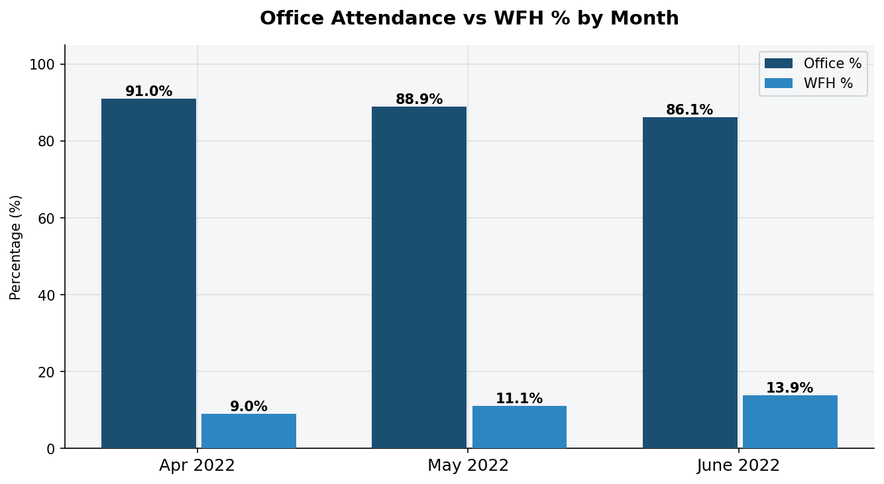
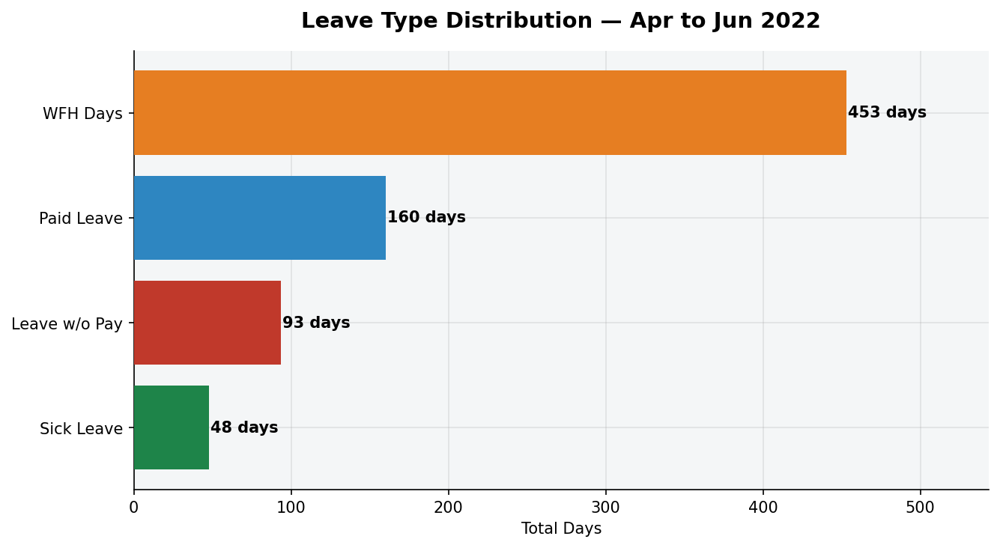
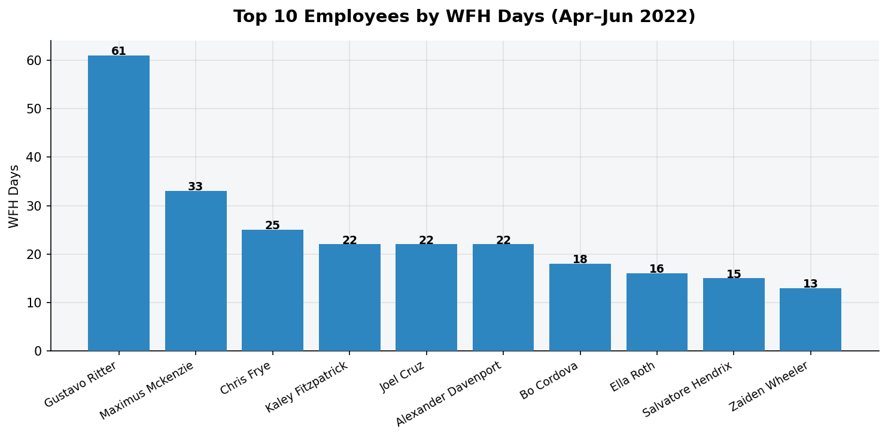
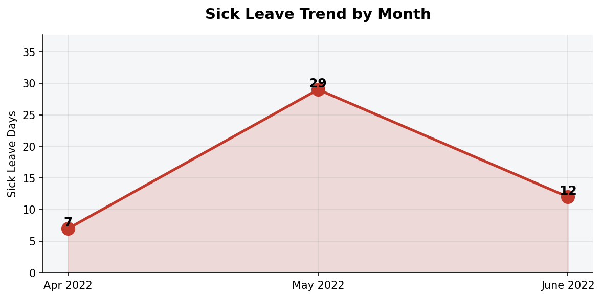
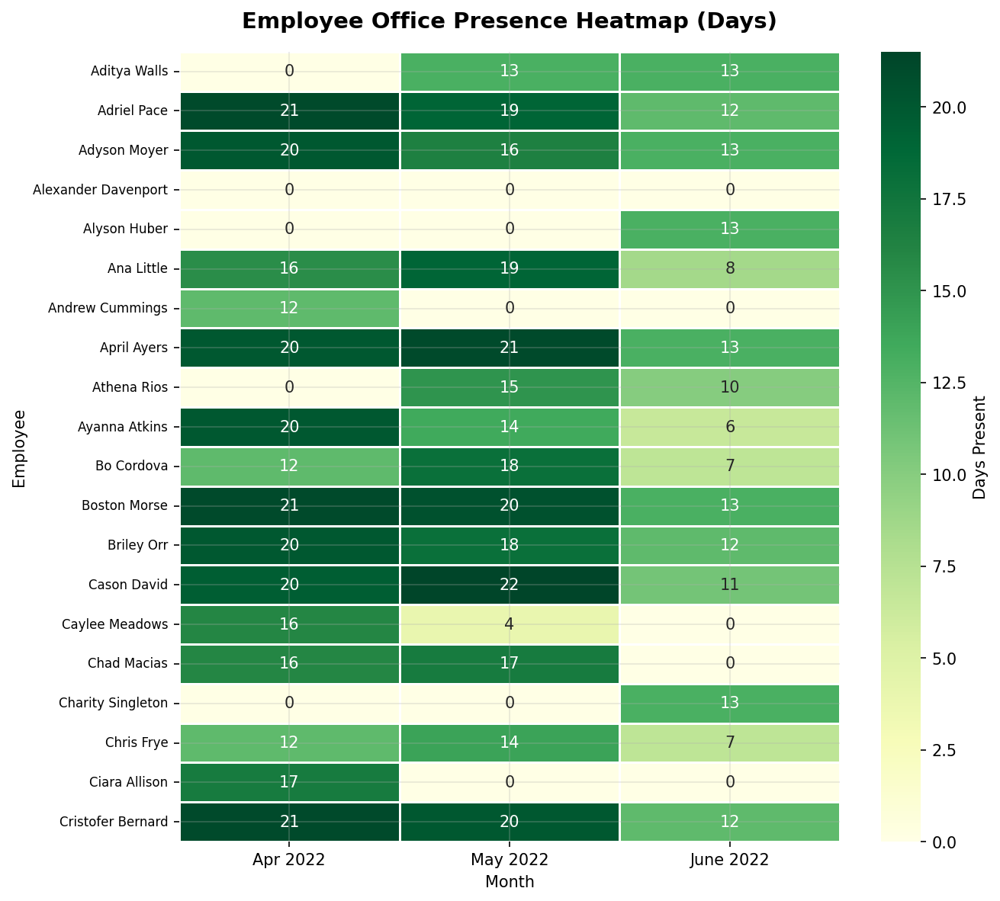

# 📊 HR Analytics — AtliQ Technologies
### Employee Attendance & Leave Analysis | Apr–Jun 2022


---

## 📌 Project Overview

This project analyses **3 months of employee attendance data** from AtliQ Technologies (April–June 2022) to uncover patterns in office presence, work-from-home (WFH) trends, and leave behaviour. The goal is to help the HR team make data-driven decisions around hybrid work policy and employee wellness.

---

## 🎯 Business Questions Answered

- What percentage of employees are working from office vs from home each month?
- Which leave types are most frequently used?
- Is sick leave increasing over time (potential burnout signal)?
- Which employees have the highest WFH usage?
- How consistent is individual employee attendance across months?

---

## 📁 Project Structure

```
HR-Analytics-AtliQ/
├── Attendance-Sheet-2022-2023.xlsx   ← Raw dataset
├── HR_Analytics_AtliQ.ipynb          ← Full Python analysis notebook
├── screenshots/                       ← All charts
│   ├── 01_attendance_vs_wfh.png
│   ├── 02_leave_distribution.png
│   ├── 03_top_wfh_employees.png
│   ├── 04_sick_leave_trend.png
│   └── 05_attendance_heatmap.png
└── README.md
```

---

## 🔢 Key Metrics

| Metric | Value |
|---|---|
| Total Employees Tracked | 99 |
| Months Analysed | Apr 2022, May 2022, Jun 2022 |
| Total Working Days Tracked | 4,120 |
| Total WFH Days | 453 |
| Total Paid Leave Days | 160 |
| Total Sick Leave Days | 48 |

---

## 📈 Analysis & Visualisations

### 1. Office Attendance vs WFH % by Month


> **Insight:** WFH adoption grew steadily from **9% in April** to **13.9% in June**, indicating a shift toward hybrid work. Office attendance dipped from 91% → 86.1%, which HR should monitor.

---

### 2. Leave Type Distribution


> **Insight:** WFH is the dominant "away from office" category. Paid Leave (160 days) is used more than Sick Leave (48 days), suggesting employees are planning time off rather than falling sick — a healthy sign.

---

### 3. Top 10 WFH Employees


> **Insight:** A small group of employees accounts for the majority of WFH days. This could be used to identify roles best suited for a permanent hybrid arrangement.

---

### 4. Sick Leave Trend by Month


> **Insight:** Sick leave increased in June — a potential early indicator of employee fatigue or seasonal illness. HR can proactively schedule wellness check-ins in coming months.

---

### 5. Employee Attendance Heatmap


> **Insight:** Most employees maintain consistent attendance (dark green) across all 3 months. Lighter cells highlight employees who frequently worked from home or took leave.

---

## 💡 Key Takeaways

1. **WFH is rising** — Increased from 9% → 13.9% over 3 months; a hybrid policy review is recommended.
2. **Sick leave spiked in June** — Could signal burnout; proactive wellness programs may help.
3. **Paid Leave is the top leave type** — Employees are utilising planned leave, which is healthy for work-life balance.
4. **Attendance is generally strong** — Over 86% office presence maintained even in the lowest month.
5. **A few employees are near-full WFH** — These roles may not need physical office presence, freeing up resources.

---

## 🛠 Tools & Technologies

| Tool | Purpose |
|---|---|
| Python 3.10 | Core language |
| Pandas | Data loading, cleaning, aggregation |
| Matplotlib | Bar charts, line charts |
| Seaborn | Heatmap visualisation |
| Jupyter Notebook | Interactive analysis |
| Google Colab | Cloud execution (no install needed) |

---

## ▶️ How to Run

**Option 1 — Google Colab (recommended, no install needed):**
1. Open [Google Colab](https://colab.research.google.com)
2. Upload `HR_Analytics_AtliQ.ipynb`
3. Upload `Attendance-Sheet-2022-2023.xlsx` when prompted
4. Run all cells

**Option 2 — Local:**
```bash
pip install pandas matplotlib seaborn openpyxl jupyter
jupyter notebook HR_Analytics_AtliQ.ipynb
```

---

## 📬 Connect

Feel free to reach out or connect on [LinkedIn](#) | [GitHub](#)

---
*Dataset source: AtliQ Technologies HR Analytics Project*
